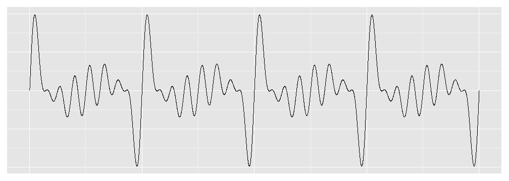

## Motivation

1. Can we visually identify consonant/dissonant chords?
2. What factors contribute to consonance/dissonance?
3. Build general intuition about chord qualities.
4. See chords

---

## Educational Uses

1. Music Theory  
-See chord qualities in yet another context.  
-Visualize effect of chord inversions on consonance.  

2. Physics  
-Examples of familiar sounds as waveforms.  
-Help convert musicians to physicists.  

3. Math  
-Visual confirmation of periodicity of added sine waves.  
-Help convert musicians to mathematicians.

---

## How it works

Chords are defined by the ratio of the frequencies of constituent notes to the root note. We used a sine wave with frequency 1 as our "root note". Then make more sine waves with frequencies at multiples of 1 corresponding to the chord type chosen. These new waves are added to the "root note" to create the chord's wave form.  
  
## Included Chords
- Major/minor triads along with inversions
- 7th chords, major, minor, and dominant 7th
- Octave and 159 (2 stacked 5th intervals)
- Power chords (plain, major, and minor)

---

## Code Demo
This is a snippet of code modified to assume "majpower" and 8 root note cyles have been selected.


```r
chordtype = "majpower"
root.cycles = 8
if (chordtype == "majpower") {
    fund.mult = c(1, 3/2, 2, 10/4, 6/2, 4)
}
## make our x/time variable also initialize our dummy note and chord
x <- seq(0, root.cycles, by = 0.001)
newnote <- x
chord <- rep(0, length(x))
## building the chord wave
for (i in 1:length(fund.mult)) {
    newnote <- sin(2 * pi * fund.mult[i] * x)
    chord <- chord + newnote
}
```


---

## Graph Demo
So let's see that power chord!  
 


Looking at fund.mult, we see the the least common denominator for our frequency ratios is 2. In our graph, we see 4 powerchord cycles for 8 root note cycles. So we can see that the LCD of our frequency ratios is the number of root note cycles to get a full chord cycle.

---

## Credit where it's due

I got these frequency ratios from Michigan Technological University's Physics of Music webpage about [chords](http://www.phy.mtu.edu/~suits/chords.html). 
  
To learn more about the Physics of Music, feel free to browse the [index page](http://www.phy.mtu.edu/~suits/Physicsofmusic.html).

Thank you B. H. Suits for making these notes available!
